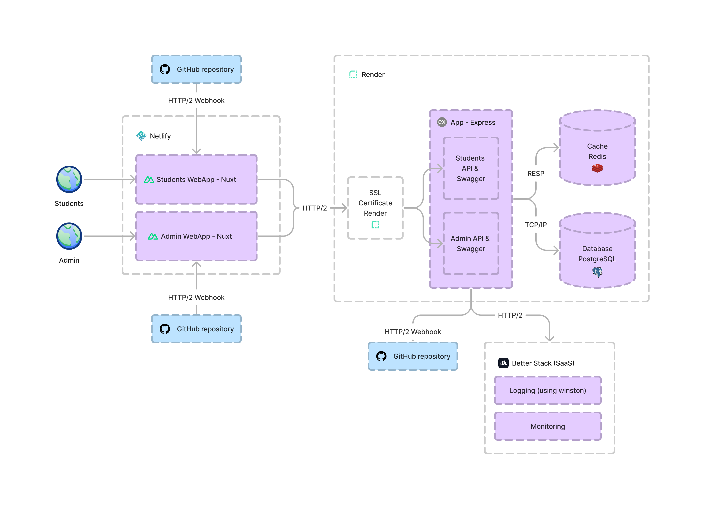
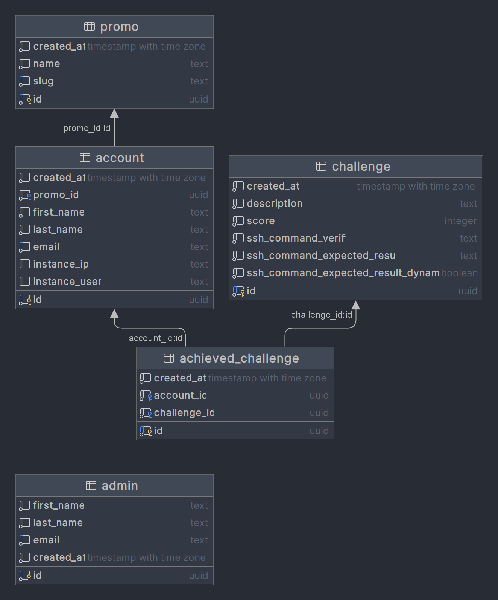

# 🚀 MT4 Challenge API (team #2)

## ✍🏻 Technologies Used
- [Nest](https://github.com/nestjs/nest)
- [Express](https://expressjs.com/fr/)
- [TypeORM](https://typeorm.io/)
- [Swagger](https://swagger.io/)
- [JSON Web Token](https://jwt.io/)
- [PostgreSQL](https://www.postgresql.org/)
- [Redis](https://redis.io/)
- [Docker](https://www.docker.com/)

## 📋 Requirements
- [Docker](https://www.docker.com/)
- Environments variables in `.env.docker` file (secret)

## 🧑🏻‍💻 Local installation (using Docker)
```shell
$ docker-compose up --build
```

## 🗎 Challenges answers
### Challenge #1 (5/20)
```shell
$ cd ~/
$ touch helloworld.txt
$ echo 'Hello, World!' > helloworld.txt
```

### Challenge #2 (7/20)
```shell
$ cd ~/
$ touch byebyeworld.txt
$ echo 'Bye Bye, World!' > byebyeworld.txt
```

### Challenge #3 (15/20)
```shell
# Download https://we.tl/t-jYOz9v07GF
# Then, transfer .zip file from your local to your virtual machine
$ cd ~/
$ sudo apt-get install unzip
$ unzip <FILENAME> -d bastien
$ touch count_files.sh
$ echo '#!/bin/bash
count=0
parcourir_repertoire() {
    local dir="$1"
    for file in "$dir"/*; do
        if [ -f "$file" ]; then
            if [[ "$file" == *.json || "$file" == *.js ]] && [ $(du -k "$file" | cut -f1) -gt 500 ]; then
                ((count++))
            fi
        elif [ -d "$file" ]; then
            parcourir_repertoire "$file"
        fi
    done
}
directory="./bastien"
if [ ! -d "$directory" ]; then
    echo "Répertoire introuvable."
    exit 1
fi
parcourir_repertoire "$directory"
echo "$count"' > count_filess.sh
$ chmod +x count_files.sh
```

### Challenge #4 (20/20)
```shell
$ cd ~/
$ touch today_french.sh
$ chmod +x today_french.sh
$ echo 'date +"%d %B %Y" | sed "s/January/janvier/;s/February/février/;s/March/mars/;s/April/avril/;s/May/mai/;s/June/juin/;s/July/juillet/;s/August/août/;s/September/septembre/;s/October/octobre/;s/November/novembre/;s/December/décembre/"' > today_french.sh
```

## ✒️ Schemas
### Architecture schema


### Database schema
<p align="center">
    
</p>

## 🔗 Production links
- Application ➡️ https://mt4challenge.netlify.app
- Admin ➡️ https://mt4challenge-back-office.netlify.app/
- Application API documentation ➡️ https://mt4challenge.onrender.com/swagger/app
- Admin API documentation ➡️ https://mt4challenge.onrender.com/swagger/back-office

## 📄 License
This repository is [MIT licensed](LICENSE).